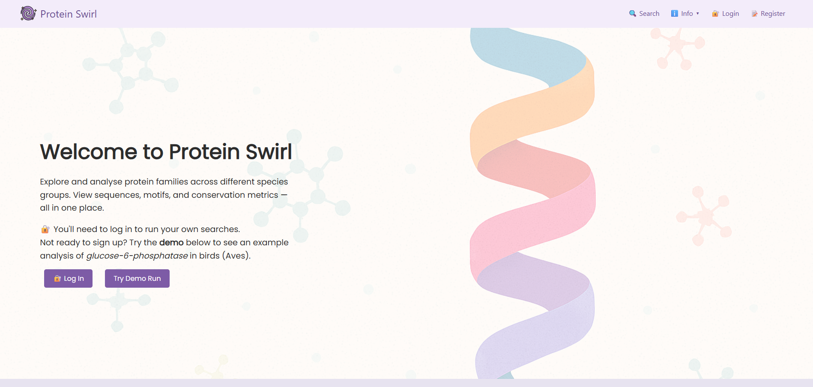

# Protein Swirl
          

**Protein Swirl** is a website to search, analyse, and visualise protein sequences by taxon and family. Built for the Introduction to Website and Database Design (BILG11016) course at the University of Edinburgh, it combines sequence retrieval, multiple sequence alignment, motif detection, and visualisation — all wrapped in a simple user interface.

### Motivation and Learning Outcomes
 - To combine web development with a bioinformatics workflow.
- To deepen understanding of backend scripting (Bash/Python) and database driven applications.
- To explore the integration of biological analysis tools (Clustal Omega, EMBOSS) into a web context.

## Table of Contents
- [Installation](#installation)
- [Usage](#usage)
- [Features](#features)
- [Technologies Used](#technologies-used)
- [Screenshots](#screenshots)
- [Credits](#credits)
- [License](#license)
- [Future Improvements](#future-improvements)

## Installation
Clone the repository and set up a local web server (e.g. XAMPP, LAMP):
```bash
git clone https://github.com/cemileblks/bioinf-web-project
```
 1.  Import the provided `.sql` file into your MySQL database.
 2. Update database credentials in `config.php`.
 3.  Ensure EMBOSS and Clustal Omega are installed and accessible in your `$PATH`.
 4.  Set executable permissions on Bash and Python scripts if necessary.
 5. Start your web server and access `index.php` in your browser.

## Usage
Use the web site to:
-   Search protein sequences by name and taxon.
-   Run Clustal Omega to align sequences and generate guide trees.
-   Detect conserved motifs via EMBOSS `patmatmotifs`.
-   View output as downloadable files and visual plots.

### Demo
Try the live version here:  
🌐  [https://bioinfmsc8.bio.ed.ac.uk/~s2756532/web_project/index.php](https://bioinfmsc8.bio.ed.ac.uk/~s2756532/web_project/index.php)

Welcome page of the project:

Search page (glucose-6-phosphatase in Aves, top 10 sequences):

Results page (tree, matrix, plots, tables, downloads): 


## Features
-   🔍 Search proteins by name and taxonomy
-   🧬 Run multiple sequence alignment (Clustal Omega)
-   🌳 Visualise guide trees interactively (jsPhyloSVG)
-   🎯  Detect conserved motifs (EMBOSS `patmatmotifs`)
-   📊 Generate custom plots: identity matrix, motif frequency (Python)
-    💾 Save and revisit past queries (user login)
-   🧪 Demo mode available (no login needed)

## Technologies Used

-   **Frontend**: HTML, CSS, JavaScript (Raphael.js, jsPhyloSVG)
-   **Backend**: PHP (with PDO), Bash scripts
 -   **Database**: MySQL
-   **Bioinformatics**: Clustal Omega, EMBOSS, Biopython
-   **Plotting**: Python (matplotlib, seaborn)

## Credits
See full attribution and references on the site’s 📚 [Statement of Credits](https://bioinfmsc8.bio.ed.ac.uk/~s2756532/web_project/credits.php)

Main tools and libraries used:
-   [Clustal Omega](http://www.clustal.org/omega/README)
-   [EMBOSS patmatmotifs](https://emboss.bioinformatics.nl/cgi-bin/emboss/help/patmatmotifs)
-   [jsPhyloSVG](https://github.com/guyleonard/jsPhyloSVG)
-   [Raphael.js](https://dmitrybaranovskiy.github.io/raphael/)

AI assistance (ChatGPT) was used for debugging, scripting help, and layout suggestions — all reviewed and adapted.

## License

🧾 This project was developed for educational purposes only. No commercial license is granted.

### Future Improvements
-   Add BLAST support
-   Allow multiple motif detection runs per session
-   Improve mobile responsiveness
